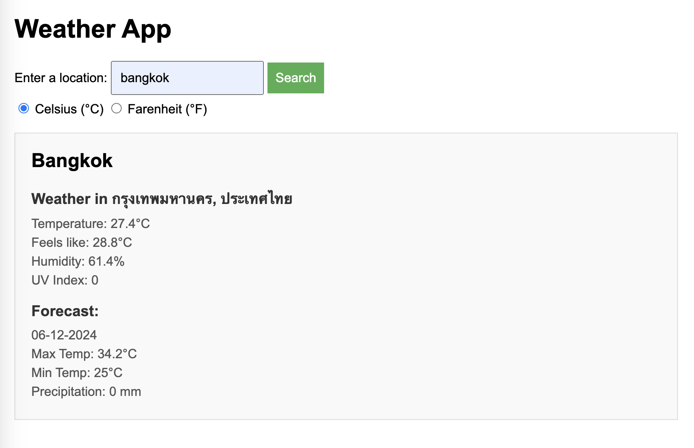

# Weather App

A weather forecast app using Visual Crossing API to fetch weather data. Practice using async and await functions for asynchronous code. Users can search for a specific location and toggle data from Fahrenheit to Celsius.

[Live demo](https://golfsap.github.io/weather-app/)

## Screenshot

